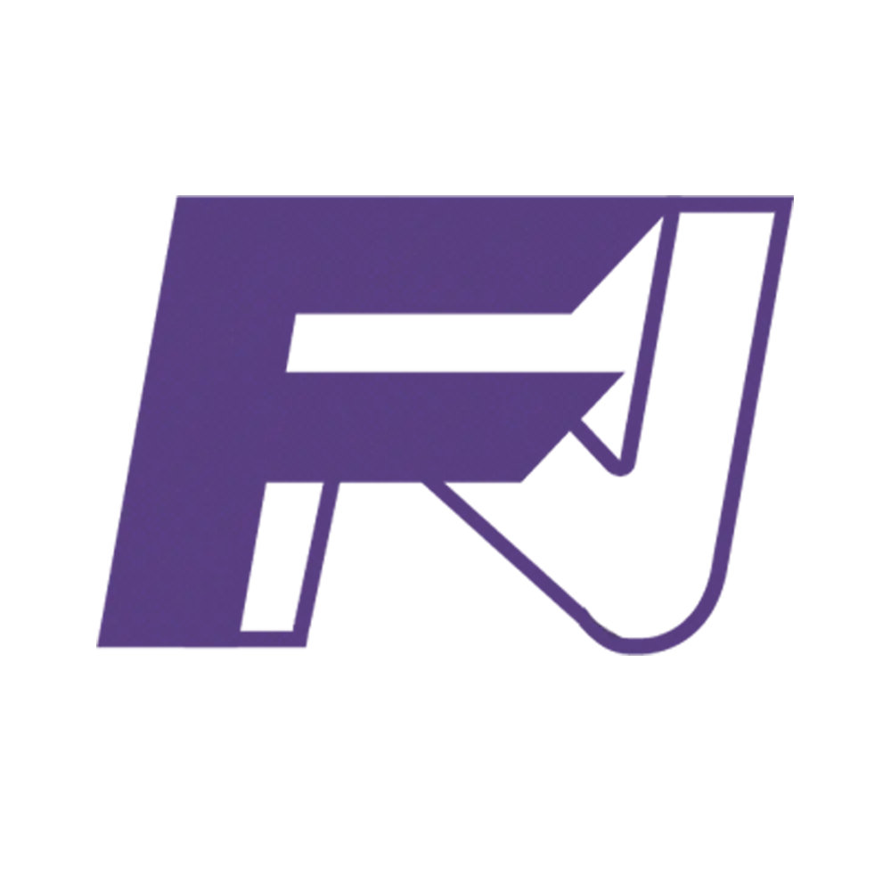

# Francisco Neto | Portfólio Pessoal

  
  
Portfólio pessoal com foco em interface moderna, narrativa profissional e apresentação de projetos reais.

  <a href="https://portfolio-three-gold-45.vercel.app/"><strong>Visualizar Portfólio Live</strong></a>

 

  
  
  
  
  

---

## Visão Geral

Este projeto é a versão atual do meu portfólio, desenvolvido com **Next.js 16 + React 19 + TypeScript**.  
O foco está em combinar visual forte com performance, mantendo a experiência fluida em mobile, tablet e desktop.

## Arquitetura de Conteúdo

O portfólio está estruturado em seções principais:

* **Início (Hero):** apresentação com headline, imagem e stack animada.
* **Trajetória:** resumo profissional + linha do tempo da evolução técnica.
* **Projetos:** cards em slider com destaque para projetos e tecnologias usadas.
* **Serviços:** visão objetiva das áreas de atuação.
* **Contato:** canais diretos para conexão profissional.

## Diferenciais Técnicos

* **App Router (Next.js 16):** estrutura moderna e escalável.
* **UI Motion:** animações com Framer Motion e transições por scroll.
* **Responsividade completa:** ajustes para mobile, tablet e desktop.
* **Performance:** otimizações de carregamento, imagens e recursos críticos.
* **Componentização:** organização por seções reutilizáveis em `src/components/portfolio`.

## Projetos em Destaque

* **Cats & Dungeons**
* **PawSpace**
* **GsW Website**
* **Atmisuki Portfolio**

## Especificações

* **Desenvolvedor:** Francisco Neto
* **Stack Principal:** Next.js, React, TypeScript, Tailwind CSS.
* **Hospedagem:** Vercel.

---

  
Este projeto está sob a licença <strong>All Rights Reserved</strong>.

