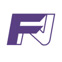

# Francisco Neto | Portfólio Pessoal

<div align="center">
  
  <p>Portfólio pessoal com foco em interface moderna, narrativa profissional e apresentação de projetos reais.</p>
  <a href="https://portfolio-three-gold-45.vercel.app/"><strong>Visualizar Portfólio Live</strong></a>
</div>

<br />

<div align="center">
  
  
  
  
  
</div>

---

## ⚠️ Antes de editar o conteúdo

A seção **Experiência** (`src/components/portfolio/lib/data.ts` → `experiences`) descreve
trabalho coberto por acordo de confidencialidade vitalício.

**Pode entrar:** nome da empresa, cargo, período, natureza genérica do trabalho e tecnologias.

**Não pode entrar, nunca:** nomes de clientes ou de projetos internos, prints de tela,
trechos de código, diagramas de arquitetura, metodologias proprietárias, métricas de
negócio e nomes de colegas.

Na dúvida, descreva a *capacidade* ("integração entre sistemas corporativos"), não a
*entrega* ("integrei o sistema X do cliente Y").

---

## Visão Geral

Portfólio desenvolvido com **Next.js 16 (App Router) + React 19 + TypeScript + Tailwind CSS 4**,
priorizando performance, acessibilidade e uma base de código simples de manter.

## Arquitetura

```
src/
├── app/                          # App Router: layout, página, SEO (robots, sitemap, OG image)
└── components/portfolio/
    ├── lib/                      # Dados, tema, utilidades e componentes-cliente pequenos
    │   ├── data.ts               # Todo o conteúdo do site (fonte única)
    │   ├── site.ts               # URL canônica, título e descrição
    │   ├── theme.ts              # Tipos, store do tema e script de pré-hidratação
    │   ├── scroll.ts             # Rolagem ancorada + altura do header
    │   ├── Reveal.tsx            # Animação de entrada via IntersectionObserver
    │   └── SmoothLink.tsx        # Âncora com rolagem suave
    ├── pages/PortfolioPage.tsx   # Casca interativa (header, tema, seção ativa)
    └── sections/                 # Hero, Trajetória, Experiência, Projetos, Serviços, Contato
```

**Fronteira cliente/servidor:** só `PortfolioChrome`, `Header`, `Projects`, `Reveal` e
`SmoothLink` são Client Components. Todas as seções de conteúdo são Server Components —
o `framer-motion` só é carregado por causa do cover flow em Projetos.

## Decisões técnicas

* **Tema sem flash:** um script síncrono no `<head>` (`THEME_INIT_SCRIPT`) aplica o tema salvo
  antes do primeiro paint. O modo é lido com `useSyncExternalStore`, o que também sincroniza
  a escolha entre abas abertas.
* **Contraste nos dois temas:** cores de acento vêm de tokens (`--accent-text`, `--accent-strong`)
  calibrados para passar no WCAG AA tanto no claro quanto no escuro. Não use `text-violet-*`
  direto — use `.portfolio-text-accent` / `.portfolio-btn-accent` / `.portfolio-chip`.
* **Reveal sem listener de scroll:** o `IntersectionObserver` informa pelo `boundingClientRect`
  se o elemento saiu por cima ou por baixo, dispensando rastrear a direção manualmente.
  As regras CSS são escopadas em `html.js`, então sem JavaScript o conteúdo continua visível.
* **Sem layout shift no slider:** as alturas do cover flow são classes responsivas e o
  deslocamento lateral é percentual — nada depende de medir `window.innerWidth` no cliente.
* **Altura do header:** definida uma vez na CSS var `--header-h` e espelhada em
  `HEADER_HEIGHT` (`lib/scroll.ts`).

## Scripts

| Comando | O que faz |
| --- | --- |
| `npm run dev` | Servidor de desenvolvimento |
| `npm run build` | Build de produção |
| `npm run lint` | ESLint 9 (flat config) |
| `npm run typecheck` | `tsc --noEmit` |
| `npm run check` | typecheck + lint + build |

## Configuração

`NEXT_PUBLIC_SITE_URL` define a origem canônica usada em metadata, `robots.txt` e `sitemap.xml`.
Sem ela, cai no domínio de produção da Vercel.

## Especificações

* **Desenvolvedor:** Francisco Neto
* **Stack:** Next.js, React, TypeScript, Tailwind CSS
* **Hospedagem:** Vercel

---

<div align="center">
  <p>Este projeto está sob a licença <strong>All Rights Reserved</strong>.</p>
</div>
